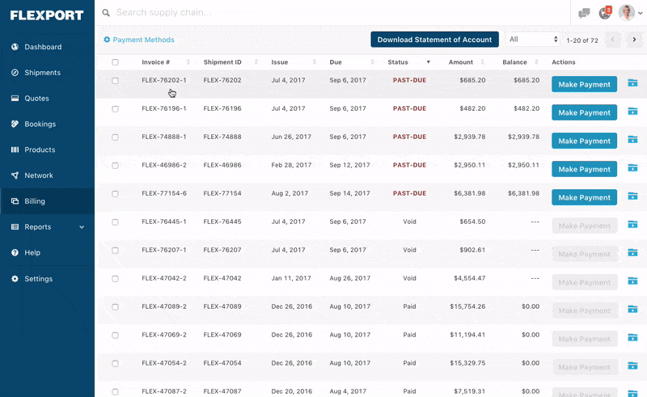

# Northwind Traders Web Application
A web application for the Microsoft Northwind sample database.

## Features
- Retrieve data from database
  - Categories
  - CustomerCustomerDemo
  - Customers
  - Employees
  - EmployeeTerritories
  - Order Details
  - Orders
  - Products
  - Regions
  - Shippers
  - Suppliers
  - Territories
- Create objects in database
- Update objects in database
- (Soft) delete objects in database
- Authentication and authorization
- Export Orders table to CSV
- View individual Order details
- View Product details
- View Customer details and their associated Orders
- View Shippers page
- UI geographic map

## UI Inspiration
Borrowing design and general userflow from Flexport. Flexport is a logistics software company, so their design
and front-end flow should fit well for a Northwind Traders application.

More designs can be found here. Credit to Andrew Coyle https://andrewcoyle.com/flexport.html.

## Minimum Viable Product
A read-only web app for viewing a table of orders.

- Retrieve an order by ID
- Retreive all orders

## Version 1.0
Version 1.0 will be built from Express.js and raw HTML, JavaScript, and CSS. The goal is a front-end built with minimal frameworks. Both backend and frontend will live in the same repository.

## Version 2.0
Version 2.0 will migrate from raw frontend code to a framework like Bootstrap, streamlining UI design.

## Version 3.0
Version 3.0 will be a larger expansion, splitting out the repository from a monorepo into a separate microservices. The backend will be served from an API, while the frontend uses a component-based UI framework like React or Vue.

## Future Technical Expansion
- Dockerization?
- Deployment to cloud hosting
  - Heroku?
  - DigitalOcean?
  - Linode?
  - AWS?
- iOS and Android mobile app
- Advanced infrastructure and app analytics
  - Amplitude
  - SumoLogic